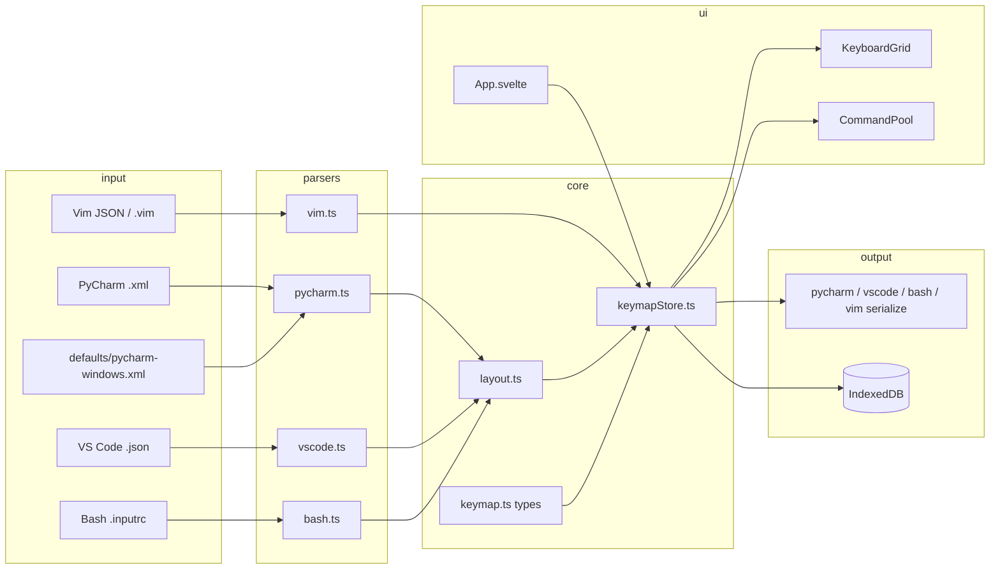

# LLM Agent Cache — keybinds-map

> Навигационный индекс для агентов. Читай **только** секции, релевантные задаче.  
> Полный README: [`README.md`](README.md)

## Суть проекта (30 сек)

Browser-first SPA (Vite + Svelte 4 + TypeScript): визуальный редактор keymap для **PyCharm** (XML), **VS Code** (JSON/JSONC), **Bash** (inputrc) и **Vim**. Всё выполняется **локально в браузере** — сервера нет. Состояние — Zustand (`structuredClone` для истории), персистенс — IndexedDB (`idb-keyval`).

**Prod:** https://katafoxi.github.io/keybinds-map/

---

## Маршрутизация по задаче

| Задача | Читать в первую очередь | Тесты | Не читать |
|--------|-------------------------|-------|-----------|
| Импорт/парсинг PyCharm XML | `web/src/lib/parsers/pycharm.ts` | `pycharm.test.ts`, `windows-default.test.ts` | `media/`, `fixture_all.json` |
| Импорт VS Code JSON/JSONC | `web/src/lib/parsers/vscode.ts` (`parseJsonc`) | `vscode.test.ts` | — |
| Экспорт VS Code JSON | `web/src/lib/parsers/vscode-serialize.ts` | `vscode-serialize.test.ts` | — |
| Импорт Bash inputrc (emacs) | `web/src/lib/parsers/bash.ts` | `bash.test.ts` | `media/` |
| Импорт Vim JSON / vimrc | `web/src/lib/parsers/vim.ts`, `vim-serialize.ts`, `web/src/lib/vim/vimView.ts` | `vim.test.ts`, `vimView.test.ts` | `media/` |
| Новый парсер / IR-контракт | `docs/PARSER_CONTRACT.md` | эталон: `pycharm.test.ts`, `vscode.test.ts` | — |
| Экспорт XML | `web/src/lib/parsers/pycharm-serialize.ts` | `pycharm.test.ts` (round-trip) | — |
| Экспорт Bash inputrc | `web/src/lib/parsers/bash-serialize.ts` | `bash.test.ts` (round-trip) | — |
| Раскладка клавиш, слоты модификаторов | `web/src/lib/keyboard/layout.ts`, `bindingPolicy.ts`, `modifierVisibility.ts` | `layout.test.ts`, `bindingPolicy.test.ts`, `modifierVisibility.test.ts` | — |
| Состояние, профили, undo, автосохранение | `web/src/lib/state/keymapStore.ts` (оркестратор) + `profilePersistence` / `history` / `vimHelpers` | `keymapStore.*.test.ts` | не читать store целиком — ищи action / модуль |
| UI / drag-and-drop | `KeyCell.svelte`, `CommandPool.svelte`, `CommandChip.svelte`, `lib/drag/slotPreview.ts` | `CommandChip.test.ts`, `portal.test.ts` | нативный HTML5 DnD |
| Выбор программы | `ProgramPicker.svelte` + `selectProgram` в store | — | — |
| Загрузка файлов | `FileDropZone.svelte` + `loadFromXml` / `loadFromVsCode` / `loadFromBash` / `loadFromVim` | — | — |
| Профили Standard/Custom1/Custom2 | `ProfileSwitcher.svelte` (confirm при перезаписи) + `switchProfile` / `copyCurrentProfile({ overwriteCustom1? })` | `keymapStore.boot.test.ts`, `keymapStore.persistence.test.ts` | `ProfileManager.svelte` — **не подключён** в App |
| Vim UI (режимы, секторы, рецепты) | `VimModeSwitcher`, `SectorLegend`, `RecipePanel`, `ExCommandPanel` | `keymapStore.boot.test.ts`, `vimView.test.ts` | — |
| i18n описаний команд | `web/src/lib/i18n/locale.ts`, `LocaleSwitcher.svelte` | `locale.test.ts` | — |
| Печать keymap | `KeyboardGrid.svelte`, `app.css` (`.print-only`, `.no-print`) | — | — |
| Каталог команд / иконки программ | `scripts/export-catalog.mjs`, `fixtures/fixture_all.json` | — | `media/pycharm_command_icons/` (сотни PNG) |
| Синхронизация ассетов | `scripts/sync-assets.mjs` | CI workflow | `web/public/icons/pycharm/` |
| CI / деплой | `.github/workflows/web.yml` (test → **check** → build → Pages) | — | — |
| Стили, шапка, layout страницы | `App.svelte`, `app.css` | `app.css.test.ts` | — |

---

## Архитектура (поток данных)



**Каталог команд:** `fixtures/fixture_all.json` → `scripts/export-catalog.mjs` → `web/public/programs.json` + `web/src/lib/catalog/programs.json` (bundled fallback через `bundledPrograms.ts`).

**IR парсеров:** `ParsedCommands` (`commandId → keyName → modifierSlot`). Vim дополнительно хранит `VimBinding[]`. Спека — [`docs/PARSER_CONTRACT.md`](docs/PARSER_CONTRACT.md).

---

## Карта директорий

```
keybinds/
├── docs/PARSER_CONTRACT.md       # IR-контракт парсеров, чеклист новой программы
├── web/                          # SPA (вся runtime-логика)
│   ├── src/
│   │   ├── App.svelte            # Корневой layout, toolbar, boot
│   │   ├── main.ts               # Точка входа
│   │   ├── app.css               # Глобальные стили + print
│   │   ├── components/           # Svelte UI (~14 компонентов)
│   │   └── lib/
│   │       ├── types/keymap.ts   # Все доменные типы
│   │       ├── state/                # keymapStore + persistence/history/vimHelpers
│   │       │   ├── keymapStore.ts    # оркестратор actions (~1150)
│   │       │   ├── profilePersistence.ts  # IndexedDB ключи/слоты
│   │       │   ├── history.ts        # snapshot / undo helpers
│   │       │   └── vimHelpers.ts     # Vim projection / patch bindings
│   │       ├── parsers/          # parse + serialize (pycharm/vscode/bash/vim)
│   │       ├── keyboard/         # layout, bindingPolicy, modifierVisibility
│   │       ├── vim/vimView.ts    # автомат режимов/prefix/operator
│   │       ├── i18n/locale.ts    # ru/en для descriptions
│   │       ├── drag/slotPreview.ts
│   │       ├── dom/portal.ts
│   │       ├── catalog/          # bundled programs.json
│   │       └── assets.ts         # assetUrl() для GitHub Pages base
│   └── public/                   # Статика (генерируется scripts/)
├── fixtures/fixture_all.json     # Источник каталога (~5k строк) — только для catalog-задач
├── test-fixtures/                # XML/JSON для vitest + alias @fixtures
├── scripts/                      # sync-assets.mjs, export-catalog.mjs
├── media/                        # Исходники иконок PyCharm — НЕ читать агенту
├── assets/ui/                    # logo, favicon
└── .github/workflows/web.yml     # CI: test → check → build → GitHub Pages
```

---

## Ключевые файлы (индекс)

### Типы — `web/src/lib/types/keymap.ts` (~190)

| Тип / константа | Назначение |
|-----------------|------------|
| `ModifierSlot` | `push`, `a`, `c`, `s`, `ac`, `as`, `cs`, `acs` — слои на клавише |
| `KeyBindings` | `Record<keyName, SlotBindings>` — основная модель раскладки |
| `CommandRef` | `{ id, shortName, icon?, descriptions?, sector?, roles? }` |
| `ParsedCommands` | Промежуточный формат парсера: `commandId → { keyName → modifierCode }` |
| `VimBinding` / `VimViewState` / `VimRecipe` | Vim IR и UI-автомат |
| `ProgramCatalog` | Список программ + каталог команд по slug |
| `ProfileSlotId` | `standard` \| `custom1` \| `custom2` |

### Store — `web/src/lib/state/`

Оркестратор: [`keymapStore.ts`](web/src/lib/state/keymapStore.ts) (~1150). Чистые хелперы:

| Модуль | Назначение |
|--------|------------|
| `profilePersistence.ts` | IDB ключи, слоты custom1/custom2, named profiles |
| `history.ts` | `KeymapStateSnapshot`, `pushHistory`, `restoreDisplay` |
| `vimHelpers.ts` | `EMPTY_VIM`, `buildVimDisplayState`, `patchVimBinding`, `applyVimToState` |

Экспорт для UI: `keymap`, `keymapStore`, `getSavedProfiles` (реэкспорт из persistence).

| Action | Что делает |
|--------|------------|
| `boot(catalog)` | Инициализация при старте App, загрузка IndexedDB |
| `selectProgram(slug)` | Смена программы |
| `loadFromXml` / `loadFromVsCode` / `loadFromBash` / `loadFromVim` / `loadFromVimrc` | Импорт файла |
| `loadDefaultKeymap` | Дефолтный keymap текущей программы |
| `switchProfile` / `copyCurrentProfile({ overwriteCustom1? })` | Слоты Standard / Custom1 / Custom2; confirm — в ProfileSwitcher |
| `assignCommand`, `moveCommand`, `moveToPool`, `assignFromPool` | DnD-операции |
| `undo` / `redo` | История до 20 шагов (для Vim — через `vimBindings` + `restoreDisplay`) |
| `exportXml` / `exportKeymap` | Скачивание XML / `.inputrc` / `keybindings.json` / `.vim` |
| `setVimMode` / `playVimRecipe` / `activateVimCommand` | Vim UI |
| `saveProfile` / `loadProfile` / `deleteProfile` | Именованные профили в IndexedDB |
| `toggleModifier`, `setPrintLayerMode` | Видимость слоёв / режим печати |

**IndexedDB ключи:** `keybinds-profiles`, `keybinds-profile-slots`, `keybinds-active-profile` (см. `profilePersistence.ts`). Автосохранение custom-слота: debounce 1500 ms.

**Дефолтный keymap:** импорт `test-fixtures/Windows.xml` через Vite alias `@fixtures` (см. `vite.config.mts`).

### Парсеры

| Файл | Вход | Выход |
|------|------|-------|
| `pycharm.ts` | PyCharm XML | `ParsedCommands` + warnings (chords, mouse skipped) |
| `vscode.ts` | VS Code keybindings JSON/**JSONC** | `ParsedCommands`; skips `-cmd` removals, meta/win/super; warns on `when` |
| `bash.ts` | GNU Readline `.inputrc` / `bind -p` (emacs) | `ParsedCommands` + warnings (chords, macros) |
| `vim.ts` | curated Vim JSON (+ recipes) | `VimBinding[]` + layers/operators |
| `pycharm-serialize.ts` | `KeyBindings` + metadata | XML string + `downloadXml()` |
| `vscode-serialize.ts` | `KeyBindings` | `keybindings.json` + `downloadVsCodeKeymap()` |
| `bash-serialize.ts` | `KeyBindings` | `.inputrc` + `downloadInputrc()` |
| `vim-serialize.ts` | `VimBinding[]` | `.vim` map dump |

Общая логика модификаторов: `modifiersToCode()` в `pycharm.ts` — ключи сортируются, код = первая буква каждого модификатора (`ctrl alt` → `ca` → slot `ac`).

### Раскладка — `web/src/lib/keyboard/layout.ts` (~88)

- `BUTTONS_BACK` / `BUTTONS_FRONT` — 4 ряда клавиш (включая F-ряд, numpad)
- `getCleanKeyboardKeys()` — пустая клавиатура
- `buildBindingsFromParsed()` — parsed → KeyBindings
- `mergeKeyboardWithBindings()` — для отрисовки grid
- `bindingPolicy.ts` — `isBounded` программы, запрет push/s на символьных клавишах (IDE), locked Ctrl+C; Vim Insert vs Normal
- `modifierVisibility.ts` — какие слои видны на экране / в печати

Имена клавиш (`backName`) — внутренний ID; алиасы PyCharm → layout в `PYCHARM_KEY_ALIASES` (`pycharm.ts`); VS Code — `LAYOUT_TO_VSCODE_KEY` в `vscode.ts`.

### UI компоненты

| Компонент | Роль |
|-----------|------|
| `ProgramPicker` | Шаг 1: выбор программы |
| `FileDropZone` | Drag & drop / file input |
| `ProfileSwitcher` | Standard / Custom1 / Custom2 + «Скопировать профиль» (confirm при обоих занятых) |
| `LocaleSwitcher` | ru/en для подсказок команд |
| `ModifierLegend` | Переключатели видимости слоёв |
| `CommandPool` | Неназначенные команды (drop target) |
| `KeyboardGrid` | Сетка клавиш + print header |
| `KeyCell` | Одна клавиша, 8 modifier-слотов, DnD |
| `CommandChip` | Иконка команды, drag source |
| `VimModeSwitcher` | Normal / Insert / Visual / Cmdline |
| `SectorLegend` | Фильтр секторов Vim |
| `RecipePanel` | Типовые последовательности Vim |
| `ExCommandPanel` | Ex-команды Vim |
| `ProfileManager` | **Legacy:** save/load именованных профилей — не в App |

DnD payload: `application/json` с `{ sourceKey, sourceSlot, command? }`.

---

## Тесты

Запуск: `cd web && npm test` (Vitest + jsdom). Typecheck: `cd web && npm run check` (есть в CI).

| Файл | Покрывает |
|------|-----------|
| `pycharm.test.ts` | Парсинг XML, modifiersToCode |
| `vscode.test.ts` | JSONC, removals, when, meta |
| `vscode-serialize.test.ts` | Экспорт + round-trip спецклавиш |
| `windows-default.test.ts` | Дефолтный Windows.xml |
| `layout.test.ts` | Раскладка, merge |
| `app.css.test.ts` | Контракт вёрстки: сетка 17 колонок, без `:global()`, tooltip `position:fixed` |
| `CommandChip.test.ts` | Один корень чипа, tooltip через portal на `document.body` |
| `keymapStore.boot.test.ts` | Boot + bash/vim defaults |
| `keymapStore.persistence.test.ts` | Восстановление custom-слота, VS Code round-trip, overwriteCustom1 |
| `keymapStore.history.test.ts` | Undo/redo PyCharm + Vim |
| `keymapStore.subscribe.test.ts` | Подписка, assign/move |
| `assets.test.ts` | `$` literal в `assetUrl` |

Фикстуры: `test-fixtures/Windows.xml`, примеры в тестах.

---

## Сборка и скрипты

```bash
# Dev (из корня)
node scripts/sync-assets.mjs && node scripts/export-catalog.mjs
cd web && npm install && npm run dev    # http://127.0.0.1:5173

# Или
npm run dev          # из корня
cd web && npm test
cd web && npm run check
cd web && npm run build
```

| Скрипт | Действие |
|--------|----------|
| `scripts/sync-assets.mjs` | media/icons → web/public; Windows.xml → test-fixtures + defaults |
| `scripts/export-catalog.mjs` | fixture_all.json → programs.json; скрывает testprog* |
| `web/vite.config.mts` | `base: './'`, alias `@fixtures` → test-fixtures |

**Поддерживаемые программы** (флаг `supported` в export-catalog): `pycharm`, `vscode`, `bash`, `vim`. Остальные в каталоге — «скоро».

Bash emacs: `fixtures/bash-emacs.json` + `test-fixtures/bash-emacs.inputrc`. Иконки — копии из PyCharm (`sync-assets.mjs` → `web/public/icons/bash/`). Пояснения команд: `descriptions.ru` (переключение языка — `uiLocale`, `pickLocalized`).

Vim: `fixtures/vim-default.json` + `fixtures/vim-recipes.json`. IR — `VimBinding` (mode/layer), UI — режимы, секторы, prefix/operator pending (`vimView`), рецепты. Экспорт `.vim` (`nnoremap`…). Insert: push/Shift bounded; Normal/Visual — нет.

---

## Не загружать в контекст

| Путь | Причина |
|------|---------|
| `media/pycharm_command_icons/` | ~300+ PNG, копируются в public |
| `web/public/icons/pycharm/` | Сгенерированные иконки |
| `fixtures/fixture_all.json` | ~5500 строк; нужен только для catalog/export |
| `web/public/programs.json` | Генерируется; читай `export-catalog.mjs` |
| `web/src/lib/catalog/programs.json` | Bundled-копия каталога |
| `node_modules/`, `web/dist/` | Артефакты |
| `ProfileManager.svelte` | Не используется в текущем UI |

---

## Быстрые якоря для grep

```
PARSER_CONTRACT       # docs/PARSER_CONTRACT.md — IR, слоты, чеклист парсера
bindingPolicy         # keyboard/bindingPolicy.ts — IDE bounded slots, locked shortcuts
modifiersToCode       # pycharm.ts — ядро маппинга модификаторов
PYCHARM_KEY_ALIASES   # XML key → layout backName
LAYOUT_TO_VSCODE_KEY  # layout ↔ VS Code key tokens
parseJsonc            # vscode.ts — JSONC без зависимости
serializeVsCodeKeymap # vscode-serialize.ts — экспорт keybindings.json
applyXmlToState       # keymapStore — импорт XML в state
restoreDisplay        # history.ts — undo/redo для Vim projection
profilePersistence    # state/profilePersistence.ts — IndexedDB
copyCurrentProfile    # store API; confirm в ProfileSwitcher
vimHelpers            # state/vimHelpers.ts — buildVimDisplayState, patchVimBinding
rehydrateCommands     # keymapStore — обновление CommandRef из catalog
MODIFIER_SLOTS        # keymap.ts — порядок слоёв
PROFILES_KEY          # IndexedDB именованные профили (profilePersistence)
PROFILE_SLOTS_KEY     # custom1/custom2 XML
assetUrl              # пути для GitHub Pages ($ literal)
```

---

## Зависимости (зачем)

| Пакет | Где |
|-------|-----|
| `zustand` | keymapStore (оркестратор) |
| `fast-xml-parser` | pycharm.ts |
| `idb-keyval` | персистенс профилей |
| `svelte` 4 | UI |
| `vitest` + `@testing-library/svelte` | тесты |

---

*Обновляй этот файл при добавлении модулей, смене архитектуры или появлении новых supported-программ.*
