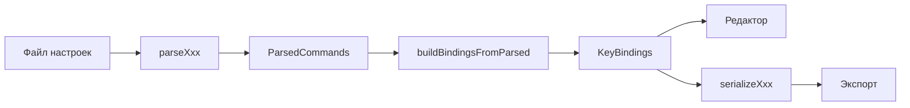

# Parser IR Contract

Контракт промежуточного представления (IR) для подключения парсеров файлов настроек к движку keybinds-map.

**Аудитория:** контрибьюторы, добавляющие поддержку новой программы.  
**Исходники типов:** [`web/src/lib/types/keymap.ts`](../web/src/lib/types/keymap.ts)

---

## Роль IR в архитектуре

Приложение разделено на три слоя:

1. **Парсер** — файл программы → `ParsedCommands` (+ warnings, опционально metadata).
2. **Движок** — `ParsedCommands` → `KeyBindings` на физической раскладке клавиатуры.
3. **UI / store** — редактирование, профили, печать, экспорт.

Парсер не знает про Svelte, IndexedDB и drag-and-drop. Достаточно реализовать преобразование в IR и (при необходимости) сериализатор обратно в формат программы.



Эталонные реализации: [`pycharm.ts`](../web/src/lib/parsers/pycharm.ts), [`vscode.ts`](../web/src/lib/parsers/vscode.ts).

---

## Тип `ParsedCommands`

```ts
type ParsedCommands = Record<string, Record<string, string>>;
// commandId → (keyName → modifierSlotCode)
```

| Уровень | Ключ | Значение |
|---------|------|----------|
| Внешний | `commandId` | Стабильный ID команды в экосистеме программы (например `EditorCopy`, `workbench.action.files.save`) |
| Внутренний | `keyName` | Имя клавиши на раскладке движка (`backName`, см. ниже) |
| Лист | `modifierSlotCode` | Код слоя модификаторов на этой клавише |

### Пример

PyCharm `EditorCopy` с `ctrl C` и `ctrl INSERT`:

```ts
{
  EditorCopy: {
    c: 'c',      // ctrl + C
    insert: 'c', // ctrl + Insert  (тот же слот c на другой клавише)
  },
}
```

VS Code `workbench.action.files.save` с `ctrl S`:

```ts
{
  'workbench.action.files.save': { s: 'c' },
}
```

### Инварианты

- Одна запись `commandId` агрегирует **все** сочетания этой команды.
- На одной паре `(keyName, modifierSlotCode)` может быть только одна команда; при коллизии побеждает последнее присвоение в парсере.
- `commandId`, отсутствующие в каталоге, всё равно попадают в раскладку; `shortName` fallback = сам `id` (см. `resolveCommand` в store).
- Команды каталога **без** привязок в `ParsedCommands` попадают в пул «неназначенных» (`buildUnassignedCommands`).

---

## Слоты модификаторов (`ModifierSlot`)

Допустимые значения листа `modifierSlotCode` — элементы `MODIFIER_SLOTS`:

| Код | Модификаторы | Пример |
|-----|--------------|--------|
| `push` | нет (plain key) | `Z` |
| `c` | Ctrl | Ctrl+Z |
| `a` | Alt | Alt+F4 |
| `s` | Shift | Shift+A |
| `ac` | Alt+Ctrl | Alt+Ctrl+S |
| `as` | Alt+Shift | Alt+Shift+Insert |
| `cs` | Ctrl+Shift | Ctrl+Shift+Z |
| `acs` | Alt+Ctrl+Shift | Alt+Ctrl+Shift+F |

Порядок букв в коде **всегда отсортирован по имени модификатора** (`alt` → `a`, `ctrl` → `c`, `shift` → `s`).

### `modifiersToCode(keystroke: string)`

Общая функция в [`pycharm.ts`](../web/src/lib/parsers/pycharm.ts). Вход — строка «модификаторы + клавиша» через пробел, lowercase:

```ts
modifiersToCode('shift ctrl z')  // → { z: 'cs' }
modifiersToCode('z')             // → { z: 'push' }
modifiersToCode('alt ctrl s')    // → { s: 'ac' }
```

Алгоритм: разбить по пробелам, последний токен — клавиша, остальные — модификаторы; модификаторы отсортировать; код = первые буквы (`ctrl alt` → `ca` → слот `ac`).

Парсеры с другим синтаксисом (VS Code `ctrl+shift+z`) должны сначала нормализовать строку в формат `modifiersToCode`, как в [`vscode.ts`](../web/src/lib/parsers/vscode.ts).

`buildBindingsFromParsed` **молча пропускает** неизвестные коды слотов (не из `MODIFIER_SLOTS`).

---

## Имена клавиш (`keyName` / `backName`)

Клавиши идентифицируются строками из `BUTTONS_BACK` в [`layout.ts`](../web/src/lib/keyboard/layout.ts). Это внутренний ID раскладки; формат файла программы может отличаться.

### Полный список поддерживаемых клавиш

| Ряд | `backName` |
|-----|------------|
| F / системные | `f1`…`f12`, `escape`, `print screen`, `scroll lock`, `pause`, `divide` |
| Цифры | `1`…`0`, `minus`, `equals`, `back_space`, `insert`, `home`, `page up`, `multiply` |
| Буквы верхнего ряда | `q`…`p`, `open_bracket`, `close_bracket`, `back_quote`, `delete`, `end`, `page down`, `subtract` |
| Средний ряд | `a`…`l`, `semicolon`, `apostrophe`, `tab`, `enter`, `space`, `up`, `None3`, `add` |
| Нижний ряд | `z`…`m`, `comma`, `period`, `slash`, `button1`, `button2`, `button3`, `left`, `down`, `right` |

Однобуквенные имена — lowercase. Спецклавиши — lowercase с пробелами (`page up`, `print screen`).

### Алиасы формата программы

Парсер обязан маппить токены исходного файла в `backName`. Пример для PyCharm — `PYCHARM_KEY_ALIASES` в `pycharm.ts`:

| Токен в файле | `backName` |
|---------------|------------|
| `page_up` | `page up` |
| `page_down` | `page down` |
| `print_screen` | `print screen` |
| `scroll_lock` | `scroll lock` |
| `none3` | `None3` |

Клавиши вне раскладки: парсер может записать их в IR, но ячейка на сетке не появится (`mergeKeyboardWithBindings` берёт только известные `backName`). Рекомендуется добавлять **warning** (как `Unknown key` в PyCharm-парсере).

Обратный маппинг для экспорта PyCharm: `KEY_TO_PYCHARM` в [`pycharm-serialize.ts`](../web/src/lib/parsers/pycharm-serialize.ts).

---

## Контракт парсера

### Минимальный интерфейс

```ts
type ParseResult = {
  commands: ParsedCommands;
  warnings: string[];
};

function parseProgramKeymap(source: string): ParseResult;
```

- **`source`** — содержимое файла (UTF-8 текст).
- **`commands`** — IR; пустой объект при полном провале разбора.
- **`warnings`** — человекочитаемые сообщения для UI (`importWarnings` в store). Не бросать исключения для ожидаемых пропусков (chords, mouse, неизвестные клавиши).

### Расширения (по необходимости)

| Поле | Когда нужно | Пример |
|------|-------------|--------|
| `skippedChords` | Подсчёт пропущенных аккордов | PyCharm `second-keystroke` |
| `skippedMouse` | Подсчёт mouse-shortcut | PyCharm XML |
| `metadata` | Имя/версия keymap в исходнике | `parsePycharmMetadata` → `KeymapMetadata` |

Типы metadata: `{ version: string; name: string }` (`KeymapMetadata`).

### Подключение к store

После парсинга store вызывает:

```ts
const resolver = (commandId: string) =>
  resolveCommand(commandId, catalog, programSlug);

const bindings = buildBindingsFromParsed(parsed.commands, resolver);
const unassigned = buildUnassignedCommands(parsed.commands, catalogRefs);
```

Новая программа добавляет action в [`keymapStore.ts`](../web/src/lib/state/keymapStore.ts) по образцу `loadFromVsCode` и ветку в [`FileDropZone.svelte`](../web/src/components/FileDropZone.svelte) / [`ProgramPicker.svelte`](../web/src/components/ProgramPicker.svelte).

---

## Каталог команд

IR ссылается на команды по `commandId`. Каталог (`ProgramCatalog`) даёт `shortName` и иконки.

**Источник:** [`fixtures/fixture_all.json`](../fixtures/fixture_all.json) → `node scripts/export-catalog.mjs` → `web/public/programs.json`.

| Модель в fixture | Поля |
|------------------|------|
| `keymap.program` | `slug`, `title`, `icon`, `site`, `settings_file_info` |
| `keymap.command` | `program` (slug), `name` (= `commandId`), `short_name`, `icon` (опционально) |

Флаг `supported: true` в [`export-catalog.mjs`](../scripts/export-catalog.mjs) включает программу в UI. Сейчас: `pycharm`, `vscode`.

Команды без каталога **работают**, но без иконок и с `shortName = id`. Для полноценного UX каталог желателен.

---

## Чеклист: новая программа

1. **Исследовать формат** файла настроек (путь, кодировка, пример).
2. **Добавить каталог** — записи в `fixture_all.json`, `export-catalog.mjs` (`supported`, `is_bounded`), иконка программы.
3. **Реализовать парсер** — `web/src/lib/parsers/<program>.ts`, выход `ParseResult`.
4. **Таблица алиасов клавиш** — константа `*_KEY_ALIASES` рядом с парсером.
5. **Тесты** — `web/src/lib/parsers/<program>.test.ts`, фикстура в `test-fixtures/`.
6. **Store + UI** — `loadFromXxx`, accept в file input, `selectProgram`.
7. **Сериализатор** (если нужен экспорт) — обратный путь `KeyBindings` → файл; сейчас только PyCharm XML.
8. **Политика биндингов** — `is_bounded` в fixture: IDE (`true`) запрещает push/Shift на символьных клавишах; CAD (`false`) разрешает plain key. Зафиксированные сочетания (Ctrl+C и т.д.) — `bindingPolicy.ts`.
9. **Документировать ограничения** — что пропускается (chords, context/when, mouse).

---

## Политика биндингов по типу программы

Логика в [`bindingPolicy.ts`](../web/src/lib/keyboard/bindingPolicy.ts), флаг `ProgramInfo.isBounded` (fixture: `is_bounded`).

| Профиль | `isBounded` | Поведение |
|---------|-------------|-----------|
| IDE / текстовый редактор | `true` | Слоты `push` и `s` на буквенно-цифровых клавишах **не принимают** drop; F-клавиши и стрелки — можно |
| CAD и аналоги | `false` | Plain key (`push`) и Shift разрешены на любых клавишах |

**Зафиксированные сочетания** (нельзя перетащить и нельзя заменить drop'ом): для PyCharm — `$Copy` на Ctrl+C, `$Paste` на Ctrl+V, `$Cut`, `$Undo`, `SaveAll`; для VS Code — clipboard/undo/save. Список расширяется в `IDE_LOCKED_BINDINGS`.

Store (`assignCommand`, `moveCommand`, `unassignCommand`) и UI (`KeyCell`, `CommandChip`) вызывают `canMutateBinding` / `canDropOnSlot` / `canDragBinding`.

---

## Ограничения движка (на момент контракта)

| Возможность | Статус |
|-------------|--------|
| Один keystroke на shortcut | Поддерживается |
| Chords (последовательности клавиш) | Не поддерживается; warning + skip |
| Mouse bindings | Не поддерживается; warning + skip |
| Context / `when` clauses | Игнорируются при импорте |
| Конфликты на одном слоте | Last-write-wins в парсере |
| Экспорт | Round-trip только PyCharm XML |
| Политика IDE vs CAD | `bindingPolicy.ts`, `isBounded` в каталоге |
| Плагины в рантайме браузера | Нет; парсер — PR в репозиторий |

---

## Ссылки на код

| Что | Файл |
|-----|------|
| IR-тип | `web/src/lib/types/keymap.ts` — `ParsedCommands`, `ModifierSlot`, `MODIFIER_SLOTS` |
| Модификаторы | `web/src/lib/parsers/pycharm.ts` — `modifiersToCode` |
| Раскладка → bindings | `web/src/lib/keyboard/layout.ts` — `buildBindingsFromParsed` |
| Политика биндингов | `web/src/lib/keyboard/bindingPolicy.ts` |
| Импорт в state | `web/src/lib/state/keymapStore.ts` — `applyXmlToState`, `loadFromVsCode` |
| Резолв команд | `keymapStore.ts` — `resolveCommand`, `buildUnassignedCommands` |
| Экспорт PyCharm | `web/src/lib/parsers/pycharm-serialize.ts` |

---

*При изменении `ParsedCommands`, `MODIFIER_SLOTS` или списка клавиш в `layout.ts` обновляй этот документ и [`LLM_AGENT_CACHE.md`](../LLM_AGENT_CACHE.md).*
